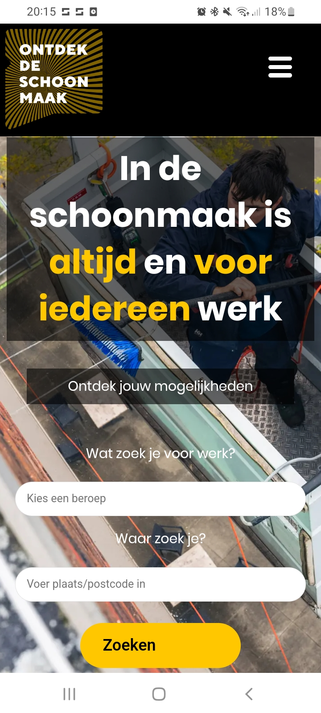

Ontwerp en maak een responsive website voor een startup.

De instructies voor deze opdracht staan in: [INSTRUCTIONS.md](https://github.com/fdnd-task/the-startup-responsive-interactieve-website/blob/main/docs/INSTRUCTIONS.md)

# Titel
<h2>OntdekDeSchoonmaak</h2>
Ik heb een opdracht gekregen vanuit het frontendbedrijf ActiveCollective om de pagina van OntdekDeSchoonmaak te ontwerpen met nieuwe ontwerpkeuzes. Zo zou het bedrijf mogelijk goede ideëen op kunnen pakken, en deze in de orginele site gebruiken. 

Het probleem was dat de pagina mobile first nog niet helemaal perfect was, en dat mensen vaak na 2 keer scrollen over de pagina al wegklikte. Ik heb dit opgelost door de pagina zo compact mogelijk te maken, en alsnog makkelijk te gebruiken.

## Beschrijving
Hoe ziet het eruit?
Ik ben natuurlijk mobile first begonnen dus zo ziet de mobiele versie eruit:

Desktop versie:

Poster Visual:

<a>https://rickfdnd.github.io/the-startup-responsive-interactive-website/</a>

<h2>Responsive Design:</h2>
Verder heb ik de mobile first principe toegepast. Hierdoor moet je rekening houden met een klein scherm dus je moet alternatieven zoeken voor grote delen zoals een navigationbar. Hiervoor heb voor een breakpoint toegepast waardoor er een hamburger menu in beeld is totdat de pagina breder wordt dan 1100 pixels. Zo blijft de website gebruiksvriendelijk op elk apparaat. 

Hier verdwijnt het hamburger menu nadat de 1100px aangetikt worden.
https://github.com/RickFDND/the-startup-responsive-interactive-website/blob/6529ffbccb09faf4ef48118cf43c29c4fc007895/main.css#L75-L77

<h2>Ontwerpkeuzes</h2>
Wij hebben voor deze sprint van school ook een opdracht gekregen om een micro-interactie te bouwen in JavaScript. Deze micro-interactie van mij is het hamburger menu geworden die je open en dicht kan klappen om de nav tevoorschijn te toveren. Ik heb deze ook een mooie animatie gegeven. Hij komt namelijk vanuit rechtsboven erin vliegen en als je hem sluit dan veranderd het kruisje weer terug naar een hamburger menu. Dit heb ik met JavaScript gedaan om de class te togglen:
https://github.com/RickFDND/the-startup-responsive-interactive-website/blob/6529ffbccb09faf4ef48118cf43c29c4fc007895/main.js#L1-L6

## Kenmerken
<h2>HTML, CSS en JS</h2>
Ik heb in de HTML, CSS en JS gebruik gemaakt van Code Conventies deze hebben wij in een workshop geleerd. Zo is het beter leesbaar en duidelijker. Ik heb de volgende standaarden gebruikt:
<h3>HTML: Ademruimte en inspringen</h3>
Door ademruimte tussen de code te houden is het overzichtelijker en kunnen andere ook de code makkelijker begrijpen. Door het inspringen is het duidelijk wat er bijvoorbeeld allemaal in een section zit. Hier bijvoorbeeld zit de header in de body, maar zitten er in de header ook nog allerlei dingen zoals de img en de nav. Daardoor staan de nav en de img net een stukje verder ingesprongen als de header.
https://github.com/RickFDND/the-startup-responsive-interactive-website/blob/6529ffbccb09faf4ef48118cf43c29c4fc007895/index.html#L10-L30

<h3>Volgorde en nesten in CSS</h3>
Ik heb in CSS een logische volgorde aangehouden die gelijk loopt met de html. In de HTML begin je natuurlijk met een body daarna een header. Zo ben ik mijn CSS ook begonnen. Daarnaast heb ik netjes genest in mijn CSS. Zo nest ik alles wat in mijn header staat ook in CSS in de header.  
https://github.com/RickFDND/the-startup-responsive-interactive-website/blob/6529ffbccb09faf4ef48118cf43c29c4fc007895/main.css#L19-L89

<h3>Nette naamgeving</h3>
Ook heb ik nette naamgeving gebruikt zo heb ik de classes in HTML duidelijk genoemd wat ze inhouden. Ook in Javascript ben ik met een duidelijke naamgeving begonnen. Zo heet mijn hamburger menu ook echt hamburgerMenu, en de navbar heet navbar:
https://github.com/RickFDND/the-startup-responsive-interactive-website/blob/6529ffbccb09faf4ef48118cf43c29c4fc007895/main.js#L1-L6

## Bronnen
https://github.com/fdnd-task/the-startup-responsive-interactive-website/blob/main/docs/mobile-first.md

https://github.com/fdnd-task/the-startup-responsive-interactive-website/blob/main/docs/refactoring-code-conventions.md

https://github.com/fdnd-task/the-client-website/blob/main/docs/code-conventies.md#geef-je-html-ademruimte

https://github.com/fdnd-task/the-client-website/blob/main/docs/code-conventies.md#schrijf-je-css-selectors-in-dezelfde-volgorde-als-de-html

https://github.com/fdnd-task/the-client-website/blob/main/docs/code-conventies.md#nest-je-media-queries

https://github.com/fdnd-task/the-startup-responsive-interactive-website/blob/main/docs/interaction-design.md

## Licentie

This project is licensed under the terms of the [MIT license](./LICENSE).

